# 👋 Hey, I'm Davion

### 💻 Cybersecurity & Networking | Tech Enthusiast

---

## 🧠 About Me

- 🎓 Studying Cybersecurity & Networking
- 🖥️ Passionate about IT support, networking, and system troubleshooting
- 🔧 I enjoy building tools that solve real world problems
- 🚀 Always learning, always improving

---

## 🛠️ Tech Stack

**Operating Systems:**
- Windows
- Linux
- macOS

**Networking:**
- TCP/IP
- DNS
- DHCP
- Basic network troubleshooting

**Tools & Languages:**
- Python
- PowerShell
- Bash
- Flask
- Wireshark

---

## 📡 Featured Projects

### 🔹 Network Monitoring Dashboard
A real-time network monitoring tool built with Python + Flask that tracks device availability and displays status in a web dashboard.

👉 Shows:
- Live device monitoring
- UP/DOWN status detection
- Web-based IT dashboard UI

---

## 📊 GitHub Stats

---

### ⚡ “Learning by building. Growing through real world IT problems.”

